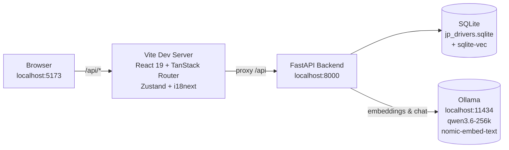

# JP Drivers Test Trainer

A bilingual (EN/PT) study tool for the Japanese driver's license written exam and closed-course skill test. Uses local AI (Ollama) for zero-cost RAG-powered explanations.

## Features

- **Study by theme** -- Browse true/false questions across all 22 official exam themes with bilingual prompts
- **Mock test (50Q / 30 min / 90% pass)** -- Timed full-length exam simulation matching the real written test format
- **RAG teacher** -- Ask AI-powered questions about any rule or scenario; answers are grounded in the local question database via sqlite-vec semantic search + Ollama
- **Skill walkthrough** -- Closed-course maneuver diagrams (S-curve, crank, parallel parking, hill start, etc.) with trajectory paths, checklist, and common mistakes
- **Study plan** -- Track progress per theme, identify weak areas, and get recommended next-study suggestions
- **EN / PT toggle** -- Switch between English and Portuguese at any point; translation status is tracked per question

## Architecture



## Prerequisites

| Tool | Version | Notes |
|------|---------|-------|
| Python | 3.13+ | Required for backend |
| uv | latest | Python package manager (`curl -LsSf https://astral.sh/uv/install.sh | sh`) |
| Node.js | 18+ | Required for frontend |
| npm | bundled with Node | Frontend dependency manager |
| Ollama | latest | Local LLM runtime (`curl -fsSL https://ollama.com/install.sh | sh`) |

Pull the required Ollama models:

```bash
ollama pull qwen3.6-256k
ollama pull nomic-embed-text
```

## Setup

Run these commands **in order** from the project root:

```bash
# 1. Install backend dependencies
cd backend && uv sync

# 2. Install frontend dependencies
cd ../frontend && npm install

# 3. Pull Ollama models
ollama pull qwen3.6-256k nomic-embed-text

# 4. Create database and seed all content
cd ../backend
uv run python scripts/apply_migrations.py
uv run python scripts/seed_themes.py
uv run python scripts/normalize.py
uv run python scripts/ingest.py
uv run python scripts/seed_skill_modules.py
```

| Step | Script | What it does |
|------|--------|-------------|
| Migrations | `apply_migrations.py` | Creates SQLite database and all tables |
| Themes | `seed_themes.py` | Inserts the 22 official exam themes (EN/PT) |
| Normalize | `normalize.py` | Ingests scraped questions: dedup, tricky-tag, translate to PT, persist |
| Ingest | `ingest.py` | Builds RAG embeddings (sqlite-vec) for AI-powered explanations |
| Skill modules | `seed_skill_modules.py` | Loads closed-course maneuver walkthrough data |

## Running

### Terminal 1 -- Backend

```bash
cd backend
uv run uvicorn src.main:app --reload
```

### Terminal 2 -- Frontend

```bash
cd frontend
npm run dev
```

Open http://localhost:5173. The Vite dev server proxies `/api` requests to `http://localhost:8000`.

## Tests

```bash
# Backend unit + integration tests
cd backend && uv run pytest

# Frontend type-check and production build
cd frontend && npm run build && tsc --noEmit

# End-to-end (Playwright)
cd frontend && npx playwright test
```

## Modes

**Offline / frontend-only development** -- no backend required:

```bash
cd frontend
VITE_API_MOCK=true npm run dev
```

This serves mock API responses so you can iterate on UI components independently.

## Troubleshooting

| Problem | Cause | Fix |
|---------|-------|-----|
| `Connection refused` when calling Ollama | Ollama is not running | Run `ollama serve`. Verify with `curl http://localhost:11434/api/tags`. |
| `sqlite-vec` fails to load on Linux | Missing build dependencies or incompatible binary | `sudo apt install build-essential python3-dev && cd backend && uv sync --reinstall` |
| EN/PT questions show different meanings | Translation drift | Check `translations_status` in DB. Values of `"machine"` need manual review. Run `normalize.py --no-paraphrase` to retranslate. |
| Migration errors on `apply_migrations.py` | Corrupted or mismatched schema | Delete `data/jp_drivers.sqlite` and re-run the full setup chain. |
| `Port 8000 already in use` | Previous uvicorn still bound | `lsof -i :8000` or `fuser 8000/tcp` to find and kill, or use `--port 8001` |
| `Port 5173 already in use` | Another Vite dev server running | Kill existing process or change port in `frontend/vite.config.ts` |
| Frontend shows blank page | Missing dependencies or build failure | Run `npm install` in `frontend/`, then restart dev server |
| Ollama model not found during ingest | Model not pulled or wrong name | `ollama list` to verify; `ollama pull qwen3.6-256k nomic-embed-text` if missing |

## Content Sourcing

All question content is gathered following the [Content Sourcing Playbook](docs/sourcing-playbook.md). Read it before adding new scrapers or questions.

## Contributing

See [docs/CONTRIBUTING.md](docs/CONTRIBUTING.md) for adding themes, questions, and skill modules.

## License

MIT. See [LICENSE](LICENSE).

## Project Structure

```
jp_drivers_test_trainer/
├── backend/
│   ├── scripts/            # Setup, seed, ingest, normalize
│   ├── src/
│   │   ├── api/            # FastAPI route handlers
│   │   ├── llm/            # Ollama client and chat logic
│   │   ├── migrations/     # SQL migration files
│   │   ├── models/         # SQLAlchemy ORM models
│   │   ├── rag/            # RAG embedding pipeline
│   │   ├── repositories/   # Data access layer
│   │   ├── schemas/        # Pydantic request/response schemas
│   │   ├── services/       # Business logic
│   │   ├── config.py       # pydantic-settings configuration
│   │   └── main.py         # FastAPI entry point
│   ├── tests/
│   ├── pyproject.toml
│   └── uv.lock
├── data/
│   ├── skill_modules/      # JSON maneuver walkthroughs
│   ├── raw_scrapes/        # Scraped question source files
│   ├── rag_source_documents/
│   ├── jp_drivers.sqlite
│   └── manual_review_queue.jsonl
├── docs/
│   ├── CONTRIBUTING.md
│   ├── sourcing-playbook.md
│   └── skill_module.schema.json
├── frontend/
│   ├── public/assets/skill/  # SVG maneuver diagrams
│   ├── src/
│   ├── tests/               # Playwright E2E tests
│   ├── dist/
│   ├── package.json
│   ├── tsconfig.json
│   ├── vite.config.ts
│   ├── tailwind.config.js
│   └── playwright.config.ts
├── scripts/
│   ├── dry_run_playbook.py
│   └── scrape_template.py
├── .gitignore
├── LICENSE
└── README.md
```
